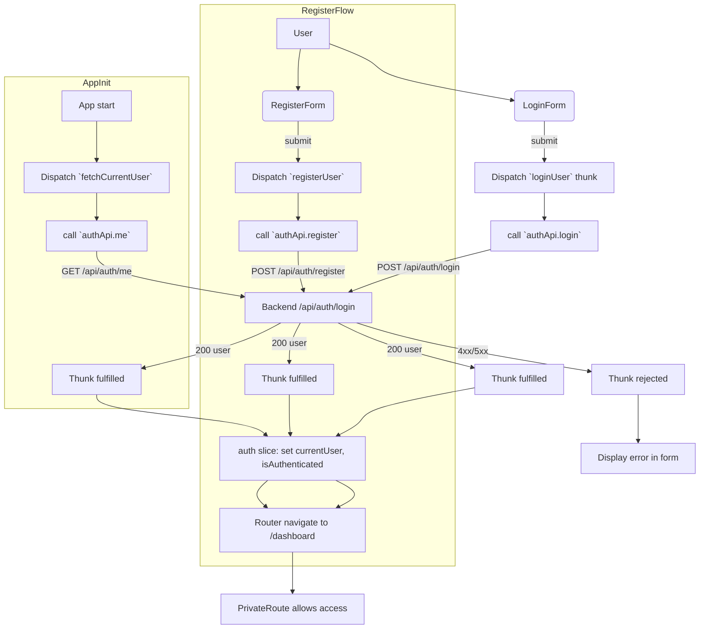

# Project README

## Authentication workflow

This project uses a centralized auth flow handled by Redux thunks and a small API wrapper. The primary flows are:

- Login: UI -> `loginUser` thunk -> `authApi.login` -> POST `/api/auth/login` -> update `auth` slice -> navigate to dashboard
- Register: UI -> `registerUser` thunk -> `authApi.register` -> POST `/api/auth/register` -> update `auth` slice -> navigate to dashboard
- Session restore: App init -> `fetchCurrentUser` thunk -> `authApi.me` -> GET `/api/auth/me` -> populate `auth` slice

Key files:

- `frontend/src/features/auth/slice.ts` — Redux thunks and `auth` slice
- `frontend/src/features/auth/api/authApi.ts` — wrapper calling `api.post` / `api.get` for `/auth/*`
- `frontend/src/services/api.ts` and `frontend/src/services/axios.ts` — axios client with `baseURL: '/api'`
- `frontend/src/features/auth/components/LoginForm.tsx` and `RegisterForm.tsx` — UI dispatching thunks
- `frontend/src/app/App.tsx` — dispatches `fetchCurrentUser()` on startup
- `frontend/src/routes/PrivateRoute.tsx` and `PublicRoute.tsx` — route guards using `auth` state

## Quick flowchart (mermaid)

## Notes and recommendations

- Current approach (Redux thunks + auth slice) is appropriate when auth state is global and used by route guards and many components.
- If you want less boilerplate and better caching/features for many API endpoints, consider migrating non-auth APIs (or auth calls) to RTK Query.
- Keep the `auth` slice as the single source of truth for `currentUser` and `isAuthenticated` so route guards (`PrivateRoute` / `PublicRoute`) and layout components remain simple.

---

Created by assistant to document auth flow and API endpoints used by the frontend and backend.
